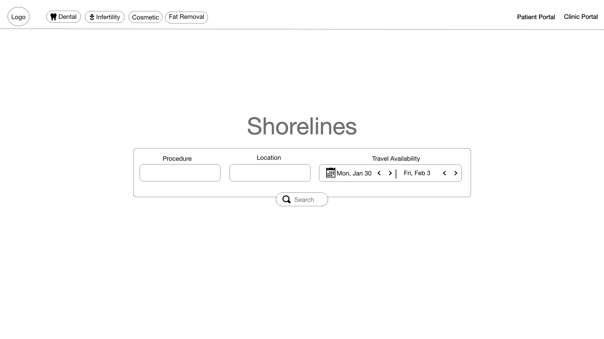
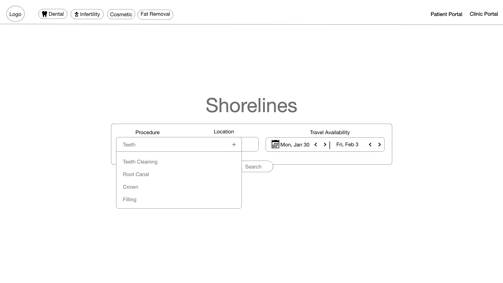
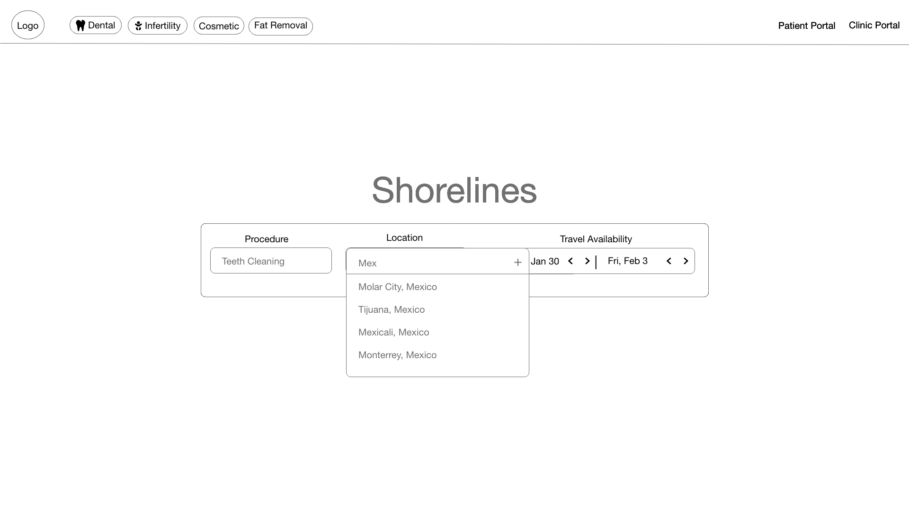
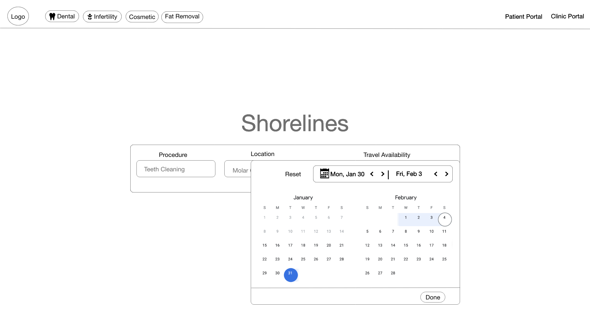
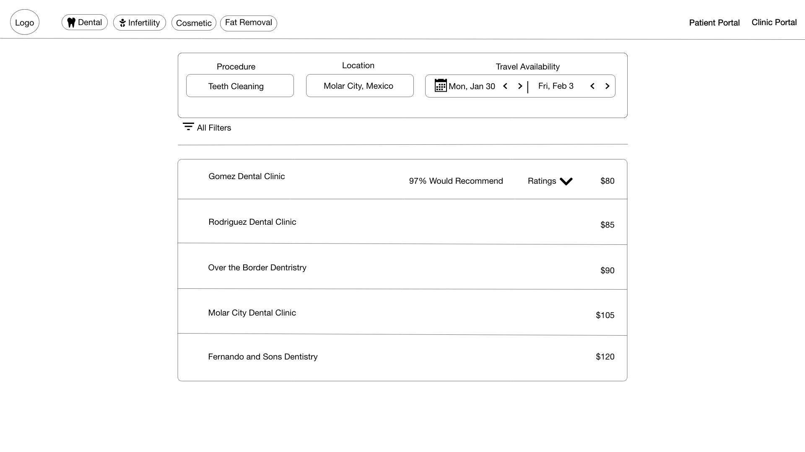
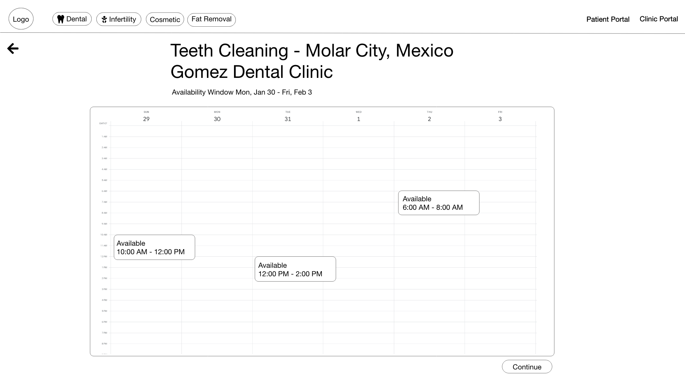
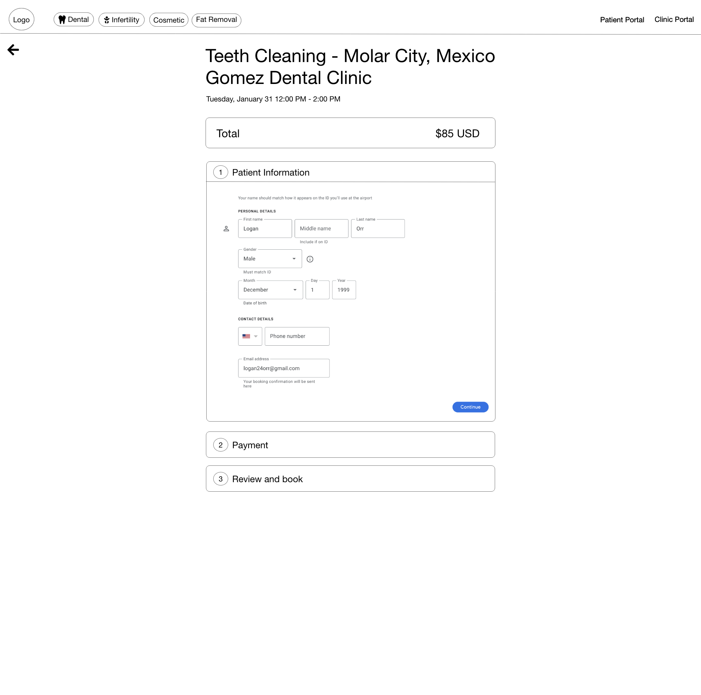
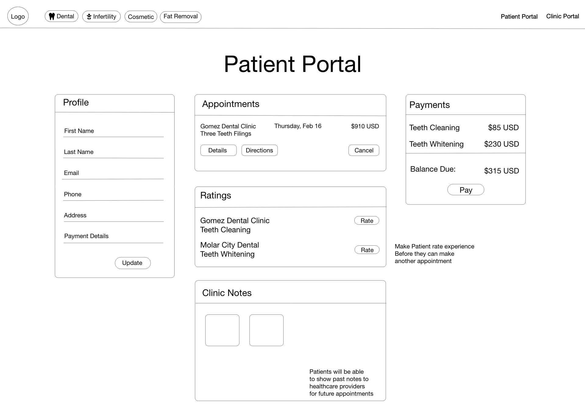
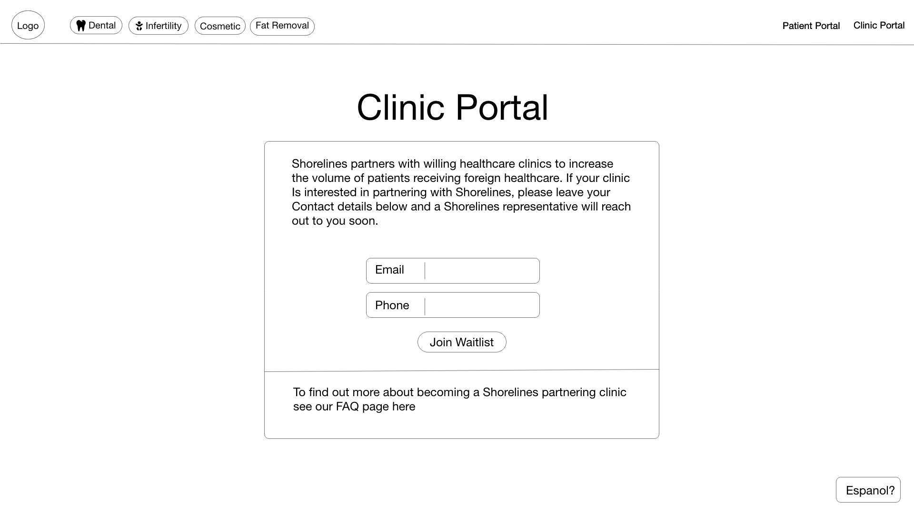

# Shorelines - A Medical Tourism Solution

## Elevator Pitch
Millions of Americans don’t have dental or health insurance. Paying out of pocket for certain dental and health treatments is expensive. Many in this situation have found cheaper out of pocket healthcare outside of the US, in particular, Mexico. The lower costs of labor and loosened healthcare restrictions allow for cheaper healthcare. It’s my assumption that many Americans would like to travel to Mexico for healthcare but have little knowledge of how to do it safely. This business would partner with dental offices across the border in Tijuana, Mexicali, Molar City, and Monterey Mexico. It would be a secure and verified payment platform that would allow Americans to book dental procedures while enjoying the valuable rating system on the different available dental practices. 

## Key Features
* Procedure search page
* Calendar selection
* Mock payments & checkout
* Clinic portal for clinics to sign up
* Client portal for viewing profile, appointments, ratings, and making payments

## Web Programming Notes
### Table element
* The html table element can produce a table grid structure to format rows and columns of data
* thead stand for table heading
* tr stands for table row
* td stands for table data
* tbody stands for table body
#### Example below
<table>
    <caption>Alien football stars</caption>
    <tr>
        <th scope="col">Player</th>
        <th scope="col">Gloobles</th>
        <th scope="col">Za'taak</th>
    </tr>
    <tr>
        <th scope="row">TR-7</th>
        <td>7</td>
        <td>4,569</td>
    </tr>
    <tr>
        <th scope="row">Khiresh Odo</th>
        <td>7</td>
        <td>7,223</td>
    </tr>
    <tr>
        <th scope="row">Mia Oolong</th>
        <td>9</td>
        <td>6,219</td>
    </tr>
</table>

### CSS Notes
Use frameworks like tailwinds and bootstrap to leverage their design components. This allows you to not have to start from scratch.
Style sheets are connected up in the head of the html document by using "link rel="stylesheet" href="styles.css""
